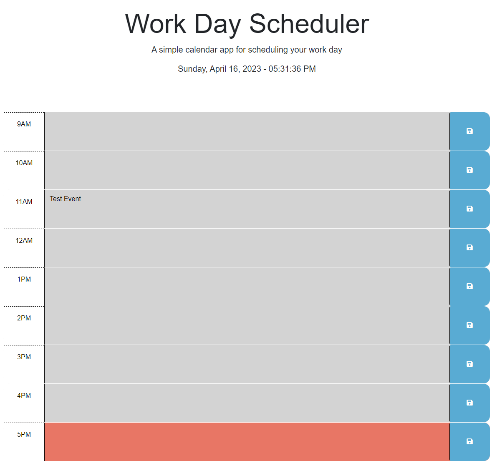

# work-planner

## Description

This is a work planner that will display a standard business day's schedule. You can enter an event in each hour slot and if you click the save button for that row it will save the event to local storage. Events are color coded with grey being in the past, red is present, and green is future.

## Screenshot

## Link

https://auswaller.github.io/work-planner/
